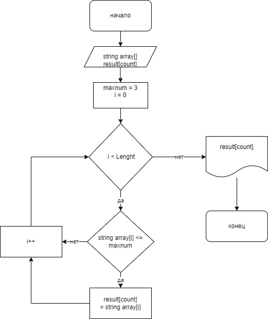

## Задача:
 Написать программу, которая из имеющегося массива строк формирует новый массив из строк, длина которых меньше, либо равна 3 символам. Первоначальный массив можно ввести с клавиатуры, либо задать на старте выполнения алгоритма. При решении не рекомендуется пользоваться коллекциями, лучше обойтись исключительно массивами.

## Блок схема решения.

## Описание решениея задачи

## 1)
* необходимо завести максмальное допустимое число знаков в слове - это maxnum = 3 
* заводим i - это значения массива которые ввел пользователь
* string array[] - изначальный массив, заполненнный значениями  i
* result[count] пустой массив в который мы в последствии будем помещать подходящие значения под наши условия

## 2) 
* проходим по всему изначальному массиву 
* значения массива которые не соответствуют условию <=maxnum мы пропускаем, а которые соответствуют помещаем в новый массив result[count]

## 3) 
* Распечатаваем новый заполненный массив result[count]